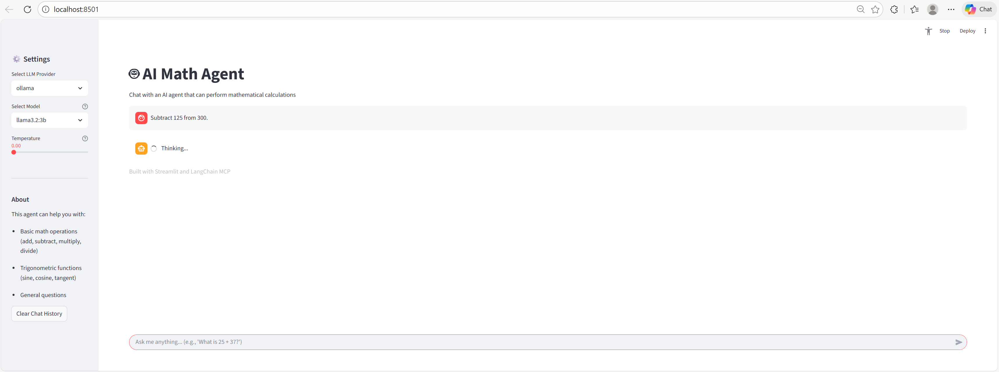
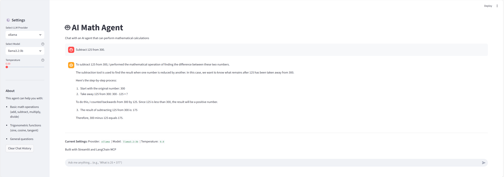

# 🤖 AI Math Agent with MCP Tools

An intelligent AI agent built with LangChain and Model Context Protocol (MCP) that can perform mathematical calculations through a chat interface. The agent supports multiple LLM providers (Ollama and OpenAI) and uses MCP tools for mathematical operations.



## ✨ Features

- **Multiple LLM Providers**: Choose between Ollama (local) or OpenAI (cloud)
- **Model Selection**: 
  - Ollama: llama3.2:3b, qwen2.5:3b, gemma2:2b
  - OpenAI: gpt-3.5-turbo, gpt-4, gpt-4-turbo
- **Math Operations**: Basic arithmetic (add, subtract, multiply, divide)
- **Trigonometric Functions**: sine, cosine, tangent
- **Interactive Chat Interface**: Built with Streamlit
- **Temperature Control**: Adjust response randomness
- **MCP Tool Integration**: Uses Model Context Protocol for extensible tool support
- **LangSmith Integration**: Optional tracing and monitoring for debugging



## 📋 Prerequisites

- Python 3.10+
- Ollama (for local models) - [Install Ollama](https://ollama.ai)
- OpenAI API Key (for OpenAI models)

## 🚀 Installation

1. **Clone the repository**
   ```bash
   git clone <your-repo-url>
   cd ai-ollama-agent-math
   ```

2. **Create a virtual environment**
   ```bash
   python -m venv .venv
   source .venv/bin/activate  # On Linux/Mac
   # or
   .venv\Scripts\activate  # On Windows
   ```

3. **Install dependencies**
   ```bash
   pip install -r requirements.txt
   ```

4. **Set up environment variables**
   ```bash
   cp .env.example .env
   ```
   
   Edit `.env` and add your API keys:
   - `OPENAI_API_KEY`: Your OpenAI API key (required for OpenAI provider)
   - `LANGCHAIN_API_KEY`: Your LangSmith API key (optional, for monitoring)

5. **Pull Ollama models** (if using Ollama)
   ```bash
   ollama pull llama3.2:3b
   ollama pull qwen2.5:3b
   ollama pull gemma2:2b
   ```

## 🎯 Usage

### Run the Streamlit App

```bash
streamlit run main.py
```

The app will open in your browser at `http://localhost:8501`

### Using the Interface

1. **Select Provider**: Choose between Ollama (local) or OpenAI (cloud)
2. **Select Model**: Pick a model based on your provider
3. **Adjust Temperature**: Control response randomness (0.0 = deterministic, 1.0 = creative)
4. **Start Chatting**: Ask mathematical questions or general queries

### Example Prompts

- "What is 25 + 37?"
- "Calculate 15 multiplied by 8"
- "What is the sine of 45 degrees?"
- "Divide 100 by 4"
- "What is the capital of the USA?" (general knowledge)

## 📁 Project Structure

```
ai-ollama-agent-math/
├── main.py                 # Streamlit app entry point
├── requirements.txt        # Python dependencies
├── .env.example           # Environment variables template
├── mcp_server/
│   └── client.py          # MCP client and agent logic
├── models/
│   ├── llm_ollama.py      # Ollama LLM configuration
│   └── llm_openai.py      # OpenAI LLM configuration
├── prompts/
│   └── prompt.py          # System prompts
├── tools/
│   └── math_tool.py       # MCP math tools (FastMCP)
└── pics/                  # Screenshots
```

## 🔧 Configuration

### LangSmith Monitoring (Optional)

To enable LangSmith tracing for debugging and monitoring:

1. Sign up at [LangSmith](https://smith.langchain.com/)
2. Get your API key
3. Update `.env`:
   ```
   LANGCHAIN_TRACING_V2=true
   LANGCHAIN_API_KEY=your_langsmith_api_key_here
   LANGCHAIN_PROJECT=ai-math-agent
   ```

### Model Requirements

The agent requires models that support **tool/function calling**. Not all models support this feature:

✅ **Supported Ollama Models:**
- llama3.2:3b
- qwen2.5:3b
- gemma2:2b

❌ **Not Supported:**
- smollm2:135m, smollm2:360m (no tool calling support)
- qwen2.5:0.5b (no tool calling support)

## 🛠️ Technologies Used

- **LangChain**: Agent framework and LLM abstractions
- **LangGraph**: Agent workflow orchestration
- **MCP (Model Context Protocol)**: Tool integration protocol
- **FastMCP**: MCP server implementation
- **Streamlit**: Web interface
- **Ollama**: Local LLM hosting
- **OpenAI**: Cloud LLM provider
- **LangSmith**: Tracing and monitoring

## 📝 Available Math Tools

The agent has access to the following MCP tools:

| Tool | Description | Parameters |
|------|-------------|------------|
| `add` | Addition | a: float, b: float |
| `subtract` | Subtraction | a: float, b: float |
| `multiply` | Multiplication | a: float, b: float |
| `divide` | Division | a: float, b: float |
| `sine` | Sine function | a: float |
| `cosine` | Cosine function | a: float |
| `tangent` | Tangent function | a: float |

## 🐛 Troubleshooting

### Issue: "ModuleNotFoundError: No module named 'langchain_mcp_adapters'"
**Solution**: Run `pip install -r requirements.txt`

### Issue: "Model does not support tools (status code: 400)"
**Solution**: The model you selected doesn't support tool calling. Use one of the supported models listed above.

### Issue: "OPENAI_API_KEY is not found"
**Solution**: Create a `.env` file and add your OpenAI API key.

### Issue: Ollama connection error
**Solution**: Make sure Ollama is running: `ollama serve`

## 📄 License

MIT License

## 🤝 Contributing

Contributions are welcome! Please feel free to submit a Pull Request.

## 📧 Contact

For questions or suggestions, please open an issue.

---

Built with ❤️ using LangChain, MCP, and Streamlit